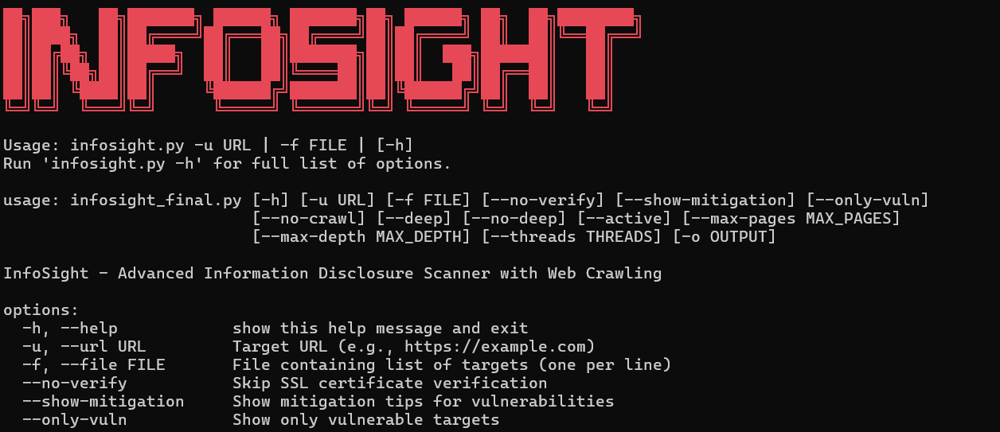

# 🕵️‍♂️ INFOSIGHT

Advanced Information Disclosure Scanner with intelligent crawling, deep HTML analysis, sensitive endpoint detection, version exposure detection, and multi-format reporting.

Built for security researchers who need a powerful, automated way to uncover leaks across an entire website.

---

## 📸 Overview



INFOSIGHT is a comprehensive web security scanner designed to identify information disclosure vulnerabilities automatically. It combines intelligent crawling, deep content analysis, and multi-threaded scanning to provide a complete view of potential security risks in your web applications.

**Key Highlights:**
- 🚀 Fast, efficient scanning with automatic deduplication
- 🎓 Learn about real-world information disclosure vulnerabilities
- 📊 Professional reporting with multiple export formats
- 🔐 Perfect for penetration testing and security assessments

---

## ✨ Features

✅ Full-site crawling with depth & page limits  
🧠 Deep HTML analysis (comments, meta tags, hidden fields, JS secrets)  
🔍 Header fingerprinting for server/framework version leaks  
🧩 Sensitive endpoint detection (/.git/, .env, backups, admin panels, configs)  
📡 Automatic SSL fallback (retry without verification if needed)  
🧪 Active mode to probe high-risk endpoints  
🧹 Automatic deduplication & domain-scoped crawling  
⚙️ Multi-threaded scanning for large target lists  
📊 Exports to JSON, CSV, XLSX, TXT  
🎯 `--only-vuln` mode for clean automation-friendly output  
🔧 Highly configurable scanning controls (crawl, deep, active, max-pages, max-depth)

---

## 🧱 Requirements

🐍 Python 3.8+  
🌐 Internet connection  
📦 Python packages from `requirements.txt`  
📘 Optional: `openpyxl` for Excel export

---

## 📦 Installation

### 1️⃣ Clone the repository

```bash
git clone https://github.com/yourusername/infosight
cd infosight
```

### 2️⃣ Install dependencies

```bash
pip install -r requirements.txt
```

---

## 🧠 Usage

### 🔹 Scan a single URL

```bash
python infosight.py -u https://example.com
```

### 🔹 Disable crawling (scan only one page)

```bash
python infosight.py -u https://example.com --no-crawl
```

### 🔹 Scan a file with multiple targets

```bash
python infosight.py -f targets.txt --threads 10
```

### 🔹 Only show vulnerable results

```bash
python infosight.py -u https://example.com --only-vuln
```

### 🔹 Enable active probing (sensitive endpoint tests)

```bash
python infosight.py -u https://example.com --active
```

### 🔹 Export results

```bash
python infosight.py -u https://example.com -o scan.xlsx
```

### 🔹 Control crawler depth & page limits

```bash
python infosight.py -u https://example.com --max-pages 50 --max-depth 3
```

---

## ⚙️ Command-Line Options

| Option | Description |
|--------|-------------|
| `-u, --url` | Scan a single URL |
| `-f, --file` | File containing list of URLs |
| `--no-verify` | Disable SSL verification |
| `--show-mitigation` | Show remediation tips |
| `--only-vuln` | Show only vulnerable results |
| `--no-crawl` | Disable crawling |
| `--deep / --no-deep` | Enable/disable deep HTML scan |
| `--active` | Enable sensitive endpoint probing |
| `--max-pages` | Limit total pages crawled |
| `--max-depth` | Limit crawl depth |
| `--threads` | Number of threads for multi-target scans |
| `-o, --output` | Export results (json/csv/xlsx/txt) |

---

## 🧩 How It Works

### 1️⃣ Initial Scan

- Sends a request
- Checks server headers for version leaks
- Attempts SSL fallback if needed

### 2️⃣ Deep Analysis (enabled by default)

- Meta generator & version leaks
- HTML comments
- Hidden fields / tokens / secrets
- JS secrets & API keys
- Email leaks
- Private IP leaks
- Cloud bucket URLs
- Error messages
- robots.txt & sitemap.xml analysis
- Directory listing detection

### 3️⃣ Active Mode (optional)

Tests endpoints such as:
- `/.git/`, `/phpinfo.php`, `/admin`, `/backup.sql`, `.env`, etc.

### 4️⃣ Crawler Engine

- Extracts links from HTML
- Deduplicates URLs
- Respects domain boundaries
- Obeys `--max-pages` & `--max-depth`

### 5️⃣ Reporting

Every scanned URL is saved with:

- Severity counts
- Detailed evidence
- Timestamp
- Indicator groups (Excel mode)

**Exports to:**

- **JSON** - raw structured output
- **CSV** - flat summary
- **XLSX** - multi-line evidence, colored severity flags
- **TXT** - pretty printed

---

## 📋 Legal & Ethical Use

**⚠️ IMPORTANT**: INFOSIGHT is intended for authorized security testing only. Unauthorized scanning of websites or networks is illegal.

Always:
- ✅ Obtain proper authorization before scanning any target
- ✅ Comply with local laws and regulations
- ✅ Use responsibly in authorized penetration tests
- ✅ Respect privacy and data protection laws

---

## 🤝 Contributing

Contributions are welcome! Please feel free to submit issues, fork the repository, and create pull requests.

---

## 📞 Support

For issues, feature requests, or questions, please open an issue on GitHub.

---

## ⚖️ License

MIT License © 2025 Vipin Giri

This tool is provided "as-is" without warranties. Users are responsible for ensuring their use of INFOSIGHT complies with all applicable laws and regulations.

---

**Version**: 1.0.0  
**Author**: Vipin Giri